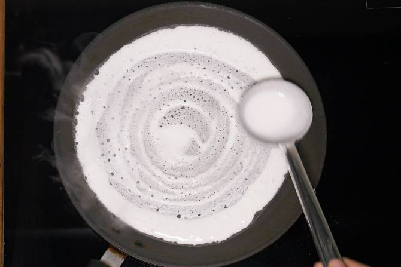
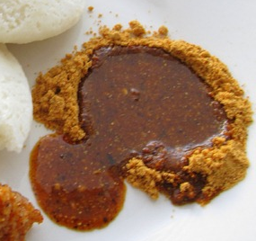

# Introduction

Hi Mom and Armando, I will be out of the house tomorrow morning. Sorry
about that, but to help you both get through the morning, I've included
breakfast recipes for you both to use. The first two recipes are for
Mom, and the last two are for Armando. (Don't worry Armando, your
recipes are vegan.) I hope the recipes are easy to follow and whatever
you make turns out great.

# How To Make Breakfast Egg Muffins

## Introduction

This recipe makes about 2 egg muffins. Feel free to multiply the amount
of ingredients by however much muffins you wish to make.

## Ingredients

-   A toaster oven

-   3 eggs

-   ½ cup shredded cheese

-   1/3 cup bacon bits

-   1/3 cup spinach

-   1 tablespoon red pepper flakes

-   2 Individual muffin pans

-   Baking mitts

-   Bowl

## Instructions

1.  Wash your spinach and let it dry.

2.  Crack the 3 eggs into a small bowl.

3.  Beat the eggs until fully mixed.

4.  Finely chop the spinach and set it aside.

5.  Add the chopped spinach, bacon bits, shredded cheese, and red pepper
    flakes into the bowl containing the beaten eggs.

6.  Mix the contents of the bowl thoroughly.

7.  Once the mix is fully mixed, pour enough of the mix into each muffin
    pan such that the mix reaches the brim of the muffin pan, as shown
    in the figure below.

*Figure 1: This is how your mix should look when poured into the muffin
pans.*

8.  Carefully set the muffin pans into your toaster oven.

9.  Set the toaster oven at 400ºF and bake the muffins for about 18
    minutes.

10. After 18 minutes of baking, you can take out the muffin pans out of
    the oven.

CAUTION: The muffin pans will be hot, so take them out carefully with
baking mitts.

11. Take the muffins out of their pans with a fork and enjoy! The
    muffins should be crisp on the outside, and soft on the inside.

# How To Make a Breakfast Wrap

## Introduction

This recipe makes 1 breakfast wrap. Feel free to multiply the amount of
ingredients by however much breakfast wraps you wish to make.

## Ingredients

-   A skillet

-   2 eggs

-   2 breakfast sausages

-   ½ cup shredded cheese

-   1/3 cup spinach

-   1 tablespoon red pepper flakes

-   1 large tortilla

-   Olive Oil

-   Spatula

-   Bowl

## Instructions

1.  Place your skillet on the stove

2.  Set the stove temperature to high.

3.  Crack your two eggs into a bowl.

4.  Beat the eggs until fully mixed.

5.  Add the red pepper flakes into the beaten eggs.

6.  Drizzle a very small amount of olive oil onto your skillet.

7.  Pour the egg mix into the skillet.

8.  When the eggs start solidifying but are still soft, break it into
    pieces. Your broken up eggs should look like the figure below.

*Figure 2: This is how your eggs should look like while breaking them apart. They can't be too cooked.*

9.  Once your scrambled eggs start to look cooked, you can take them out
    and transfer them to a plate.

10.  On that same skillet, add your two sausage patties by ripping small
    pieces off the patties and placing them on the skillet.

11.  Let the sausage pieces cook until crispy and brown on the bottom
    side, then flip each piece over and repeat.

12.  Once the sausages have been cooked, transfer the pieces to a plate.

13.  Wash your spinach and let it dry.

14.  Take your skillet off the stove and turn off the stove.

15.  Place the scrambled eggs, cooked sausages, spinach, and cheese onto
    your laid out tortilla.

16.  Wrap the tortilla and the contents inside by folding it in half, and
    then folding one of the ends shut. Enjoy your finished breakfast
    wrap.

# How To Make Dosa and Idli Podi (Vegan)

## Introduction

If you are unfamiliar, dosa is a typical vegan and Indian breakfast food
comparable to crepes. This recipe pairs it with idli podi, which is a
spicy dip paired with dosa. This recipe makes 3 dosa and enough podi to
pair with those 3 dosa. You can add as much or as little of the
ingredients to match how much dosa you'd like.

## Ingredients

-   Readymade dosa batter

-   ¼ cup Readymade idli podi

-   A Skillet

-   Spatula

-   Ladle

-   Olive Oil

-   1 teaspoon sesame oil

## Instructions

1.  Place your skillet onto your stove.

2.  Set the stove temperature to high.

3.  Drizzle a very small amount of sesame oil onto the skillet.

4.  Scoop a full ladle's worth of dosa batter out of the batter
    container.

5.  Pour the batter from the ladle into the center of the hot skillet.

6.  Immediately use the ladle to start spreading the poured batter in a
    circle clockwise and outwards, as pictured below. Do this until you
    reach the edge of the batter.

> 

*Figure 3. This image illustrates how your dosa batter should look when
spread out.*

TROUBLESHOOTING: If your batter can't be spread due to it sticking,
this means you need to try again and reduce the temperature.

7.  Once the bottom of the dosa is crisp and brown, take the dosa off
    the skillet with a spatula and set it on a plate.

8.  Repeat steps 4 through 7 two more times to have 3 dosa prepared in
    total.

9.  Turn off the stove and take your skillet off the stove.

10.  In a small bowl, pour your idli podi and sesame oil in that order.

11.  Mix the idli podi and oil with your finger until fully mixed. It
    should look as such in the below figure.

12.  Enjoy your dosa and idli podi by ripping off pieces of the dosa and
    dipping them in the idli podi.

*Figure 4. How your idli podi and oil should look after mixing.*

# How To Make Spicy Avocado Toast (Vegan)

## Introduction

This recipe makes 2 slices of spicy avocado toast. Feel free to multiply
the amount of ingredients by however many you want to make.

## Ingredients

-   A toaster oven

-   Two slices of bread (of your choosing)

-   1 Avocado

-   ½ Onion

-   1 lime

-   1 teaspoon gochujang

-   Mixing spoon

-   Butter knife

## Instructions

1.  Cut open your avocado in half, making sure to cut around the pit of
    the avocado.

2.  Take out the pit of the avocado with a spoon.

3.  Scoop out both halves of the avocado into the bowl, until all you're
    left with is the skin. (The skin can be discarded)

4.  Take your half onion and finely chop it by chopping it both
    vertically and horizontally.

5.  Pour your chopped onion pieces into the bowl with the avocado.

6.  Take your lime and cut it into a slice into about a ¼ of the lime.

7.  Squeeze the lime slice into the bowl.

8.  Pour the gochujang into the bowl.

9.  Mix the contents of your bowl with a spoon, making sure the avocado
    is smooth and mashed.

10. Place the two slices of bread in the toaster oven.

11. Make sure the cook settings are set to "Toast" and "Medium"

12. Start the toaster and wait for the bread to be toasted.

13. Once the bread is toasted, take it out on a plate.

14. Spread your avocado mix onto the two slices of toast. Your toast
    should look similar to the figure below. Your two slices of avocado
    toast are now ready to be enjoyed.

*Figure 5. An example of well mixed avocado spread on toast.*

# References

-   Recipe 1: (Original), Photos taken from:
    [https://www.eatwell101.com/cheesy-bacon-egg-muffins](https://www.eatwell101.com/cheesy-bacon-egg-muffins%09)

-   Recipe 2: (Original), Photos taken from:
    <https://www.tasteofhome.com/recipes/fluffy-scrambled-eggs/>

-   Recipe 3: (Original), Photos taken from:
    <https://www.indianhealthyrecipes.com/dosa-recipe-dosa-batter/> and
    <https://cooking.jingalala.org/2012/12/idli-podi-idli-dosa-dry-chutney-powder-idli-milagai-podi-recipe/>

-   Recipe 4: (Original), Photos taken from:
    <https://www.cookinglight.com/recipes/avocado-toast-recipe>
